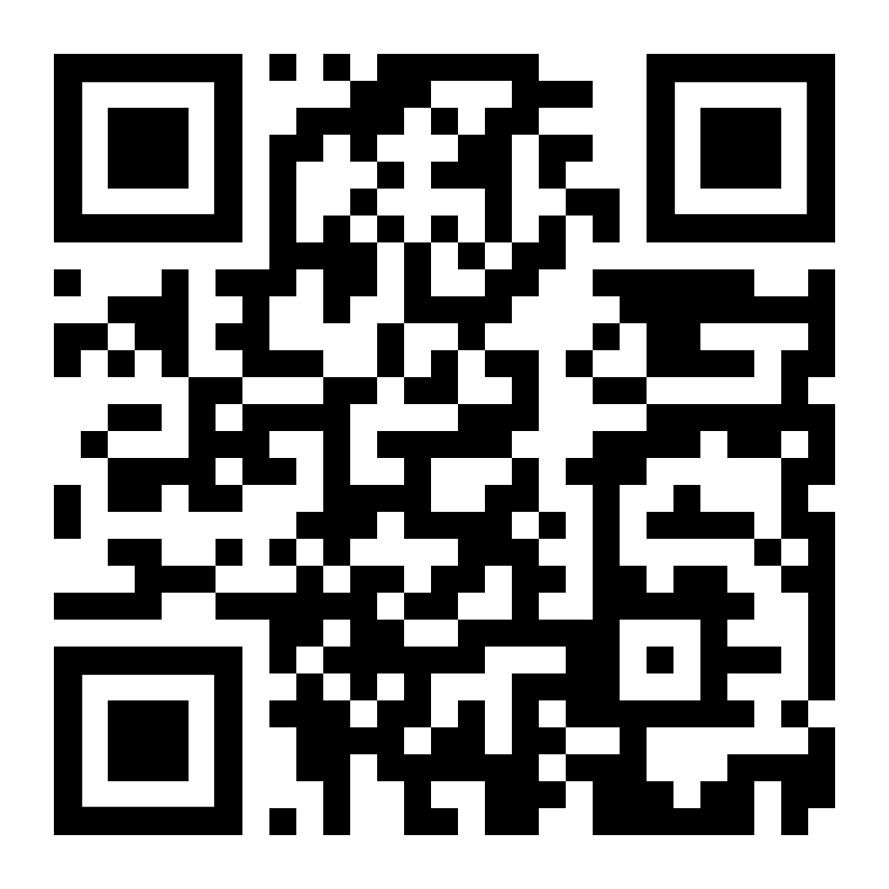

# Presentation

Use the slide deck for the lecture part of the session, then switch to the notebook for the hands-on walkthrough.

## Resources

- [Download PowerPoint (.pptx)](assets/presentation.pptx)
- [View on Google Slides](https://docs.google.com/presentation/d/1MbLCZl65a0RlgKDsKgOieQ-J4rfpf8Mx/edit?usp=sharing&ouid=106019696090715174142&rtpof=true&sd=true)
- [Go to tutorial overview](tutorial.md)

## QR Codes

**DVCUBE**

**My GitHub**

## Preview

[Open Google Slides](https://docs.google.com/presentation/d/1MbLCZl65a0RlgKDsKgOieQ-J4rfpf8Mx/edit?usp=sharing&ouid=106019696090715174142&rtpof=true&sd=true)

---

**Navigation:** [← Home](index.md) | [Tutorial →](tutorial.md)
