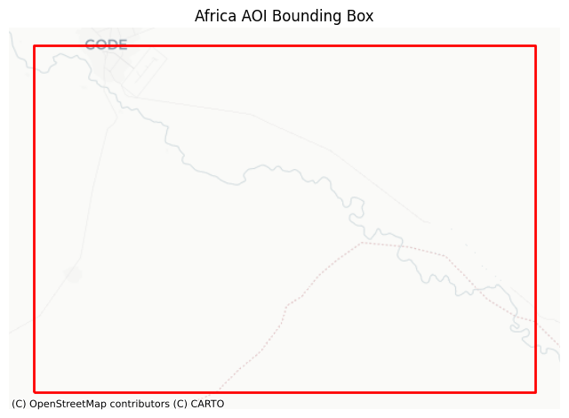
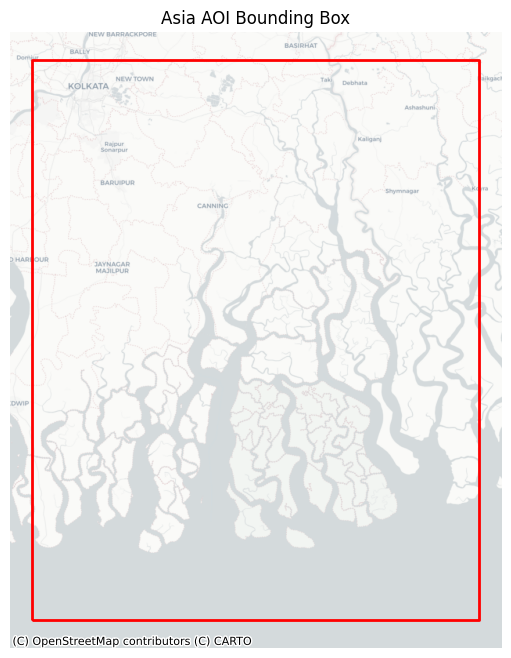

# Tutorial Overview

## Workflow

**`cubo` for data access** → **`xarray` for analysis** → **Dask for scaling**

## Quick Links

**Cubo Tutorial**

[View as HTML](assets/cubo_xarray_dask_tutorial.html) — Rendered notebook

[Run in Google Colab](https://colab.research.google.com/github/khizerzakir/github_pages_cubo_tutorial/blob/main/cubo_xarray_dask_tutorial.ipynb) — Interactive

**EO Climate Tutorial**

[View as HTML](assets/eo_climate_resilience_tutorial_africa_asia.html) — Rendered notebook

[Run in Google Colab](https://colab.research.google.com/github/khizerzakir/github_pages_cubo_tutorial/blob/main/eo_climate_resilience_tutorial_africa_asia.ipynb) — Interactive

## Concepts covered

- what a remote EO cube call looks like
- how `xarray` labels dimensions like `time`, `band`, `y`, `x`
- why Dask-backed chunks matter
- why `.compute()` should happen late
- how the same `cubo.create(...)` call can target:
  - **Google Earth Engine**
  - **default STAC access**
  - **another STAC endpoint**

**Colab Tip:** Use **Runtime → Run all** after package installation cells complete.

## Other tutorial in this project

The second tutorial focuses on climate resilience applications across Africa and Asia:

- [EO climate resilience notebook](assets/eo_climate_resilience_tutorial_africa_asia.ipynb)
- includes AOI setup for `gode_afric` and `ban_asia`
- uses MPC/STAC and cubo-friendly workflows for participants without GEE
- includes NDVI snapshots, search patterns, and integrated climate-context examples

## Using medium-resolution EO data: key points

- medium-resolution products are strong for regional monitoring and trend analysis
- revisit frequency is often more important than fine spatial detail for resilience signals
- keep spatial and temporal windows small first, then scale with Dask
- always check scaling factors, QA flags, and product-specific metadata
- combine EO indicators with rainfall and local context before interpretation

## Study Areas

---

**Navigation:** [← Home](index.md) | [Slides](slides.md)