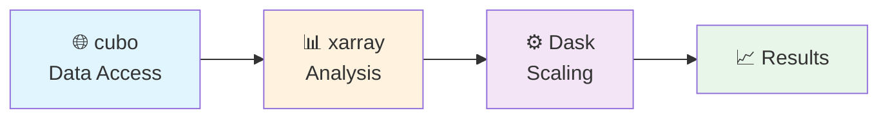

# 📖 Tutorial Overview

## 🔄 Workflow

## 🔗 Quick Links

=== "📓 Notebooks"
    - [View cubo tutorial (HTML)](assets/cubo_xarray_dask_tutorial.html)
    - [View EO climate tutorial (HTML)](assets/eo_climate_resilience_tutorial_africa_asia.html)
    - [Download cubo notebook](assets/cubo_xarray_dask_tutorial.ipynb)
    - [Download climate notebook](assets/eo_climate_resilience_tutorial_africa_asia.ipynb)

=== "☁️ Colab"
    - [Launch cubo in Colab](https://colab.research.google.com/github/khizerzakir/github_pages_cubo_tutorial/blob/main/cubo_xarray_dask_tutorial.ipynb)
    - [Launch EO climate in Colab](https://colab.research.google.com/github/khizerzakir/github_pages_cubo_tutorial/blob/main/eo_climate_resilience_tutorial_africa_asia.ipynb)

## 💡 Key Concepts

- ✅ Remote EO cube API calls
- ✅ xarray dimensions: `time`, `band`, `y`, `x`
- ✅ Dask chunking strategy
- ✅ Lazy evaluation with `.compute()`
- ✅ Flexible backends:
    - Google Earth Engine
    - STAC
    - Custom endpoints

## Notebook

- [Rendered HTML notebook](assets/cubo_xarray_dask_tutorial.html)
- [Raw notebook](assets/cubo_xarray_dask_tutorial.ipynb)
- [Open cubo tutorial in Colab](https://colab.research.google.com/github/khizerzakir/github_pages_cubo_tutorial/blob/main/cubo_xarray_dask_tutorial.ipynb)
- [Open EO climate tutorial in Colab](https://colab.research.google.com/github/khizerzakir/github_pages_cubo_tutorial/blob/main/eo_climate_resilience_tutorial_africa_asia.ipynb)

!!! tip "💡 Colab Runtime Tip"
    Use **Runtime → Run all** after package installation cells complete.

!!! warning "⏰ Execution Time"
    Some operations may take 5-10 minutes depending on data volume and cloud load.

## 🌱 Climate Resilience Tutorial

The companion tutorial focuses on practical applications across Africa and Asia:

!!! check "Featured Content"
    - **[Open climate notebook](assets/eo_climate_resilience_tutorial_africa_asia.ipynb)**
    - AOI setup for Africa (`gode_africa`) and Asia (`ban_asia`)
    - MPC/STAC workflows (no GEE needed)
    - NDVI time series, search patterns, climate context

## 🎯 Medium-Resolution EO Best Practices

!!! info "Why Medium-Resolution?"
    - Ideal for regional monitoring and trend analysis
    - Revisit frequency > spatial detail for resilience signals
    - Cost-effective for large areas

!!! check "Implementation Guidelines"
    - Start small: limit spatial and temporal windows
    - Scale up with Dask once proven
    - Validate scaling factors and QA flags
    - Combine with rainfall data and local context
    - Never interpret EO signals in isolation

## Study Areas

| Africa | Asia |
|--------|------|
|  |  |