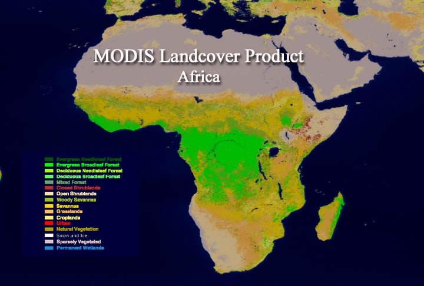
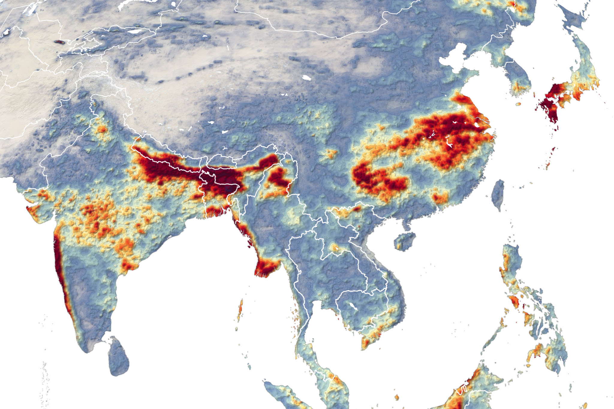

<link rel="stylesheet" href="assets/site.css">

# Tutorial overview

This tutorial keeps the user-facing workflow simple:

> **`cubo` for data access, `xarray` for analysis, Dask for scaling**

  

    <strong>Rendered HTML</strong>
    <a href="assets/cubo_xarray_dask_tutorial.html">Open notebook as HTML</a>
  

  

    <strong>Run in Google Colab</strong>
    
  

  

    <strong>EO climate notebook</strong>
    
  

## Concepts covered

- what a remote EO cube call looks like
- how `xarray` labels dimensions like `time`, `band`, `y`, `x`
- why Dask-backed chunks matter
- why `.compute()` should happen late
- how the same `cubo.create(...)` call can target:
  - **Google Earth Engine**
  - **default STAC access**
  - **another STAC endpoint**

## Notebook

- [Rendered HTML notebook](assets/cubo_xarray_dask_tutorial.html)
- [Raw notebook](assets/cubo_xarray_dask_tutorial.ipynb)
- [Open cubo tutorial in Colab](https://colab.research.google.com/github/khizerzakir/github_pages_cubo_tutorial/blob/main/cubo_xarray_dask_tutorial.ipynb)
- [Open EO climate tutorial in Colab](https://colab.research.google.com/github/khizerzakir/github_pages_cubo_tutorial/blob/main/eo_climate_resilience_tutorial_africa_asia.ipynb)

  Colab runtime tip: use <strong>Runtime → Run all</strong> after package installation cells complete.

## Regional examples

### Africa

### Asia

