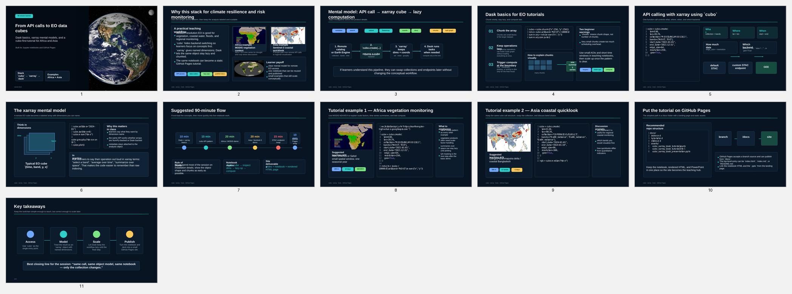

<link rel="stylesheet" href="assets/site.css">

  <a href="index.md">Home</a>
  <a href="tutorial.md">Tutorial</a>
  <a href="slides.md">Slides</a>

# Tutorial overview

This tutorial keeps the user-facing workflow simple:

> **`cubo` for data access, `xarray` for analysis, Dask for scaling**

  

    <strong>Rendered HTML</strong>
    <a href="assets/cubo_xarray_dask_tutorial.html">Open notebook as HTML</a>
  

  

    <strong>Rendered HTML</strong>
    <a href="assets/eo_climate_resilience_tutorial_africa_asia.ipynb">Open EO climate notebook file</a>
  

  

    <strong>Run in Google Colab</strong>
    
  

  

    <strong>EO climate notebook</strong>
    
  

## Concepts covered

- what a remote EO cube call looks like
- how `xarray` labels dimensions like `time`, `band`, `y`, `x`
- why Dask-backed chunks matter
- why `.compute()` should happen late
- how the same `cubo.create(...)` call can target:
  - **Google Earth Engine**
  - **default STAC access**
  - **another STAC endpoint**

## Notebook

- [Rendered HTML notebook](assets/cubo_xarray_dask_tutorial.html)
- [Raw notebook](assets/cubo_xarray_dask_tutorial.ipynb)
- [Open cubo tutorial in Colab](https://colab.research.google.com/github/khizerzakir/github_pages_cubo_tutorial/blob/main/cubo_xarray_dask_tutorial.ipynb)
- [Open EO climate tutorial in Colab](https://colab.research.google.com/github/khizerzakir/github_pages_cubo_tutorial/blob/main/eo_climate_resilience_tutorial_africa_asia.ipynb)

  Colab runtime tip: use <strong>Runtime → Run all</strong> after package installation cells complete.

## Other tutorial in this project

The second tutorial focuses on climate resilience applications across Africa and Asia:

- [EO climate resilience notebook](assets/eo_climate_resilience_tutorial_africa_asia.ipynb)
- includes AOI setup for `gode_afric` and `ban_asia`
- uses MPC/STAC and cubo-friendly workflows for participants without GEE
- includes NDVI snapshots, search patterns, and integrated climate-context examples

## Using medium-resolution EO data: key points

- medium-resolution products are strong for regional monitoring and trend analysis
- revisit frequency is often more important than fine spatial detail for resilience signals
- keep spatial and temporal windows small first, then scale with Dask
- always check scaling factors, QA flags, and product-specific metadata
- combine EO indicators with rainfall and local context before interpretation

## Regional examples

### Africa

### Asia

## Image swiper

  <button class="swiper-btn" id="tutorial-swiper-prev" aria-label="Previous image">&#10094;</button>

  

    
    
    
    
  

  <button class="swiper-btn" id="tutorial-swiper-next" aria-label="Next image">&#10095;</button>

Image 1 of 4

- [Go back to the home page](index.md)